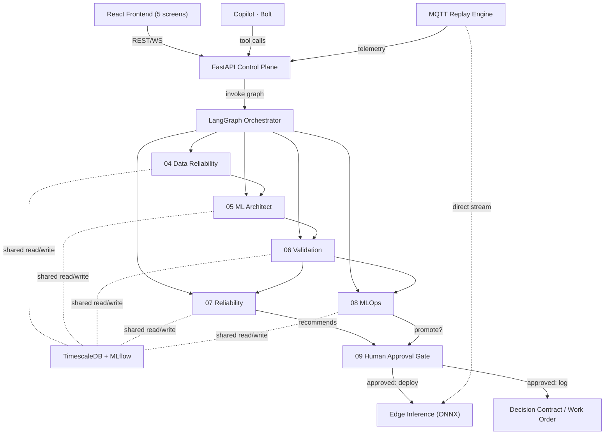

# Thor — Development Guide

> Agentic AutoML + MLOps copilot for industrial predictive maintenance.
> Governed architecture: **LLM plans → deterministic code computes → engineer decides.**
> This file is intentionally longer than the usual ~200-line CLAUDE.md guideline because it
> covers a multi-agent system end to end. If it gets stale, split sections into `.claude/rules/*.md`
> rather than letting this drift out of sync with the code.

Full function-level architecture reference (diagram + every function, role, and connection):
`docs/architecture.html` (open it in a browser).

## 1. What Thor is (read this before writing code)

Thor ingests raw industrial sensor telemetry, automatically profiles it, trains and validates
a predictive-maintenance model, explains its prediction with cited evidence, turns that into a
cost-based maintenance recommendation, and stops — every consequential action requires an
explicit human approval, logged as an immutable Decision Contract.

**Thor is a companion to the plant's MES/CMMS, not a replacement for one.** It does not schedule
production, manage inventory, or dispatch labor. Its output — the Decision Contract — is a
handoff artifact designed to feed an existing MES/CMMS, not become one. Never describe Thor as
an MES in code comments, docs, or the submission.

## 2. Submission positioning — Theme 1 (Agentic Predictive Maintenance Studio)

We submit under **Theme 1 only**. Use this language verbatim when drafting submission text;
don't invent new claims.

- **One-liner:** "An agentic AutoML + MLOps platform that turns raw industrial sensor data into
  a validated, explainable, human-approved predictive-maintenance decision."
- **Differentiators to lead with** (most teams stop before any of these):
  1. **Regime-aware fault detection** — clusters operating state (RPM/load/startup) first, so a
     load change is never mistaken for a failure.
  2. **Industrial Model Score** — champion selection weighted by recall, warning lead time,
     calibration, and inference latency, not raw accuracy.
  3. **Decision Contract** — an immutable, evidence-linked audit record for every recommendation
     (provenance + explainability + auditability).
  4. **Prescriptive, not just predictive** — compares cost of maintain-now / maintain-later /
     run-to-failure before recommending a window.
  5. **Governed agent architecture** — the LLM only plans and explains; every number comes from
     deterministic code; a human approves every action. State this as architecture, not a slogan.
- **Rubric mapping** (one line each, no invented point totals):
  - *Innovation:* regime-awareness + prescriptive layer, not another anomaly-threshold demo.
  - *Technical excellence:* time/asset-aware validation, calibration, drift detection, MLflow
    registry, edge deployment.
  - *Problem-solution fit:* directly implements every bullet in ABB's Theme 1 feature list.
  - *Scalability:* asset → site → enterprise story via the Decision Contract as an MES/CMMS
    integration point (say this explicitly — it's a real scalability argument, not filler).
  - *UX / Presentation:* one motor, one emerging fault, one decision — no feature-tour demo.
- **Tech stack to name-drop:** Python, FastAPI, MLflow, LangGraph, Docker, SHAP, LightGBM/XGBoost,
  PostgreSQL — these are ABB's own suggested Theme 1 technologies, so use them by name.
- **Never:** claim a specific dollar savings as fact (say "under these configurable plant-cost
  assumptions..."); cite unverified competitor claims; call any part of this an MES.

## 3. Tech stack

| Area | Choice | Note |
|---|---|---|
| LLM | OpenAI (chat completions, function calling) or Anthropic Claude (Messages API, tool use) — selected by `LLM_PROVIDER` / whichever key is set | Read **only** in `apps/api/orchestrator.py` — two calls per run: route, then draft the explanation; plus the Bolt tool loop |
| ML | scikit-learn, XGBoost, LightGBM | No CNN/autoencoder — dropped by design, not by omission |
| AutoML search | Optuna | Tree models only |
| Explainability | SHAP | Feeds `explain()` in the Reliability Agent |
| RAG / retrieval | Chroma (embedded) + sentence-transformers | Local embedding model — **no external embedding API**. Index built once at startup from `data/manuals/*.pdf`, persisted to a Docker volume |
| Agent orchestration | LangGraph | One process, five agent node groups — not five services |
| API | FastAPI + Pydantic | Single control-plane service |
| Frontend | React + TypeScript | Five screens (§5) |
| Streaming | Mosquitto (MQTT) + a replay script | Time-accelerated historical replay, not random live data |
| Storage | PostgreSQL + TimescaleDB extension | Telemetry hypertable, assets, decision contracts, registry metadata |
| MLOps | MLflow | Experiment tracking + registry, artifacts on a mounted Docker volume — **not MinIO** |
| Drift detection | Hand-rolled PSI | ~30 lines, not the Evidently library — one fewer dependency |
| Edge | ONNX Runtime in a second lightweight FastAPI container | Subscribes to MQTT directly, independent of the control plane |
| Packaging | Docker Compose | **Not Kubernetes** — one command (`docker compose up`) must always work |
| CI | GitHub Actions | Lint + unit tests on push |
| Tests | pytest (logic) + 1-2 Playwright smoke tests | Not a full e2e suite |

## 4. Architecture



**Thor vs. Bolt, in one breath.** *Thor* is the whole system above: seven Compose services and
one governed pipeline — MQTT telemetry into a FastAPI control plane and TimescaleDB, a
LangGraph orchestrator (the only Claude caller, and only to route and to phrase) driving five
deterministic toolboxes (regime-aware profiling, Optuna over RF/XGBoost/LightGBM ranked by the
Industrial Model Score and tracked in MLflow, asset-level validation with calibration and lead
time, SHAP + cost comparison, an MLOps lifecycle that promotes the champion to ONNX Runtime at
the edge), producing an immutable Decision Contract that stops at the Human Approval Gate.
*Bolt* is one component inside it: the copilot persona in the Copilot screen, a conversational
surface over the Reliability toolbox's RAG layer (Chroma index of the plant manuals, local
embeddings) that reaches data only through read-only tools on the same control plane and can
explain but never approve, promote, train, or invent a citation.

Full prose + IN/OUT for every function: see `docs/architecture.html`.

## 5. Repository layout

```
thor/
├── apps/
│   ├── api/              # FastAPI control plane + LangGraph orchestrator (one service)
│   └── web/               # React + TS — Fleet, Asset 360, AutoML Studio, ModelOps, Copilot
├── agents/                 # tool functions per role, imported by apps/api's graph — not separate services
│   ├── data_agent/
│   ├── ml_architect/
│   ├── validation/
│   ├── reliability/          # explain.py (SHAP) + rag.py (manual retrieval)
│   └── mlops/
├── edge/                    # ONNX Runtime inference container
├── streaming/
│   ├── mqtt/
│   └── replay/               # historical-sequence replay script
├── data/
│   ├── simulator/             # synthetic regime + bearing-degradation generator (primary demo data)
│   ├── benchmark/              # AI4I 2020 validation notebook (credibility check, not the demo)
│   └── manuals/                # PDF corpus for retrieve_manual_context(); indexed into Chroma at startup
├── infra/
│   └── docker-compose.yml
├── tests/
├── docs/
│   └── decision-contracts/      # example Decision Contract JSON for reference
└── CLAUDE.md
```

## 6. Agent build spec (condensed — full detail in the linked artifact)

| # | Agent | Key functions | Produces → consumed by |
|---|---|---|---|
| 04 | Data Reliability | `profile_dataset()`, `detect_missingness()`, `detect_regime()`, `validate_schema()` | Data Quality Contract → 05 |
| 05 | ML Architect | `infer_task()`, `build_feature_pipeline()`, `launch_trial()`, `compare_models()` | Candidate models + Industrial Model Score (MLflow) → 06 |
| 06 | Validation | `detect_leakage()`, `run_backtest()`, `calibrate_probabilities()`, `compute_lead_time()`, `estimate_rul_interval()` | Validation Report + Champion → 07, 08 |
| 07 | Reliability | `explain()`, `retrieve_manual_context()`, `calculate_failure_cost()`, `find_maintenance_window()`, `run_whatif()`, `create_decision_contract()` | Decision Contract + recommendation → 09 |
| 08 | MLOps | `register_model()`, `compare_champion()`, `promote()`, `detect_drift()`, `deploy_edge()` | Promotion request → 09; on drift, re-triggers 05 |
| 09 | Human Approval Gate | `present_evidence()`, `record_decision()` | Approved action → Edge deploy or logged Decision Contract |

`promote()` models the lifecycle (`candidate → validated → shadow → production`) as a **database
enum**, not live traffic-splitting — there is no real production traffic to shadow-test against
in a demo. Don't build real shadow/canary infrastructure.

The orchestrator itself (`apps/api/orchestrator.py`) is the only *agent* in the AI sense — the
five groups above are deterministic toolboxes it calls. Its own surface is small: `route()`
picks the next tool from `GraphState`, `await_approval()` pauses the graph at the Human
Approval Gate node, `resume()` continues once a decision is recorded.

## 7. Non-negotiable rules

- **NEVER** let an agent execute a maintenance action or model promotion without a recorded
  approval from `record_decision()`. This is the whole governance pitch — do not weaken it for
  a demo shortcut.
- **NEVER** validate with a random shuffle split on time-series or multi-asset data. Use
  time-ordered and asset-level splits (train on some machines, validate/test on ones the model
  has never seen).
- **NEVER** let the LLM compute a metric, a cost, or a SHAP value. It explains numbers that
  deterministic Python already produced — it does not produce them itself.
- **NEVER** read `ANTHROPIC_API_KEY` or `OPENAI_API_KEY` outside `apps/api/orchestrator.py`. One file calls the LLM;
  every other module is deterministic local compute. This is what makes the governance claim
  checkable rather than rhetorical.
- **NEVER** let the LLM invent a manual citation. `retrieve_manual_context()` returns retrieved
  passages with their source and section; the explanation may only quote what it returned.
- **ALWAYS** log Decision Contracts as immutable rows (insert-only; no in-place edits).
- **ALWAYS** default new agents/services to the `docker-compose.yml` — if it doesn't start with
  `docker compose up`, it isn't done.

## 8. Explicitly out of scope

Do not build these — they cost real hours for near-zero demo-visible payoff:

Kubernetes · real OPC UA / PLC protocol · CNN / autoencoder models · MinIO · Redis (unless a
concrete need appears) · full Prometheus/Grafana/OpenTelemetry stack (build a health panel in
the React app instead) · Neo4j · blockchain · native mobile app · real SAP/ABB API integration ·
a full Playwright e2e suite.

## 9. Data strategy

1. **Primary demo data — synthetic.** A regime-based generator (24 motors, RPM/load/startup
   regimes, injected drive-end bearing degradation on `MTR-042` as the live demo fault plus a
   handful of completed historical failures the model learns from — see `FAULTY_ASSETS` in
   `data/simulator/generate.py`) gives full control over the "cinematic" demo moment and stays
   100% reproducible via MQTT replay. The API seeds the first 80% of the history; the replay
   streams the rest. Only *completed* failures produce training labels — an in-progress
   degradation is treated as unknown future, never as a known outcome.
   **After an approval, the plant acts, not Thor.** The replay doubles as a simulated CMMS
   (`streaming/replay/work_orders.py`): once plant time reaches the approved window it takes the
   motor offline for the contract's planned downtime (no rows) and then streams that motor's own
   healthy baseline again. The API only records the plant's progress reports as insert-only
   work-order events (`GET/POST /work-orders`) and shows them on the Fleet card and in Asset 360.
   Rejected contracts and `run_to_failure` change nothing. Maintenance windows are computed in
   plant time (latest telemetry `ts`), never wall clock, so the window lands inside the replay.
2. **Credibility check — AI4I 2020 (UCI).** Run the same pipeline against a real public
   benchmark and report honest metrics. This is what proves the methodology isn't cherry-picked
   to the synthetic story.

## 10. Development commands

Create these exactly as the project is scaffolded — don't invent different entrypoints:

```bash
docker compose up --build        # everything: api, web, postgres/timescale, mqtt, mlflow, edge
uvicorn apps.api.main:app --reload   # api only, for fast iteration
npm --prefix apps/web run dev    # frontend only
pytest                            # all Python tests
ruff check .                      # lint
npm --prefix apps/web run build && npm --prefix apps/web run test  # frontend build + smoke tests
scripts/demo_reset.sh   # (or .\scripts\demo_reset.ps1) wipe DB/model volumes, reseed 80%, replay the rest live
```

## 11. Code style

- **Python:** type hints everywhere, Pydantic models for every agent input/output (this is what
  makes the LangGraph state typed and debuggable), `ruff` for lint/format.
- **TypeScript:** function components, no class components; colocate a screen's API calls with
  its component.
- **Commits:** imperative mood, one logical change per commit (`add regime detection`, not
  `updates`).
- **Every deterministic tool function gets a docstring stating its inputs/outputs** — the
  orchestrator's tool-calling reliability depends on these being accurate, not decorative.

## 12. Working in this repo with Claude Code

- This repo has the **ECC (Everything Claude Code)** plugin installed
  ([affaan-m/ECC](https://github.com/affaan-m/ECC)) — a large agent/skill harness (dozens of
  agents, hundreds of skills, reusable hooks). Before hand-rolling a workflow for testing,
  security review, or research, check what's already available (`/agents`, `/skills`, or the
  `ListSkills`/`ListPlugins` tools) and prefer an existing ECC agent/skill over writing new
  instructions from scratch when one genuinely matches the task.
- Use a research/explore-style subagent for open-ended searches across this repo once it's
  larger than a handful of files; use a general-purpose subagent for multi-file changes that
  span more than one of the directories in §5.
- Track multi-step build work (e.g., "implement Validation Agent") with the task-tracking tool
  as you go — mark steps complete as they land, don't batch it at the end.
- When a change touches §6 (agent contracts) or §7 (rules), update this file in the same PR.
  A stale CLAUDE.md is worse than none.

## 13. Timeline & definition of done

Idea Phase submission — lock down positioning (§2), architecture (§4), and this file. Prototype
Phase: Sept 18–27. Priority order under a tight time budget — do not start P1 before every P0
item runs end to end:

- **P0 (must work flawlessly):** ingest/replay → profile → train 3 candidates → validate →
  champion → SHAP explain → cost-based recommendation → human approval → Decision Contract
  logged. One motor, one fault, one decision, live in the demo.
- **P1:** cited manual context (Chroma RAG) on the explanation, MLflow registry + promote()
  state machine, drift detection, edge ONNX container, Fleet + ModelOps screens, Copilot chat.
  The P0 chain must produce a complete recommendation from SHAP + cost alone — retrieval
  enriches that explanation, it is never load-bearing for it.
- **P2 (cut first if time runs short):** what-if reliability sandbox, energy-residual feature,
  AI4I benchmark writeup polish.

## 14. References

- Full architecture cheat sheet (diagram + every function): `docs/architecture.html`
- ECC plugin: https://github.com/affaan-m/ECC
- Anthropic Claude Code best practices: https://code.claude.com/docs/en/best-practices
- AI4I 2020 Predictive Maintenance Dataset (UCI) — credibility benchmark, not primary demo data
